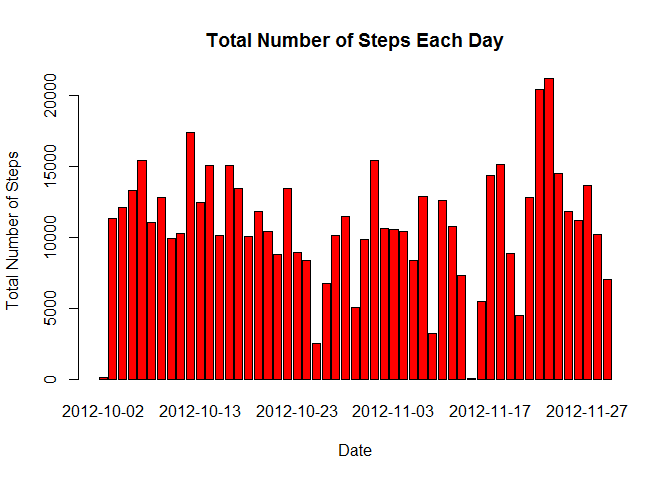
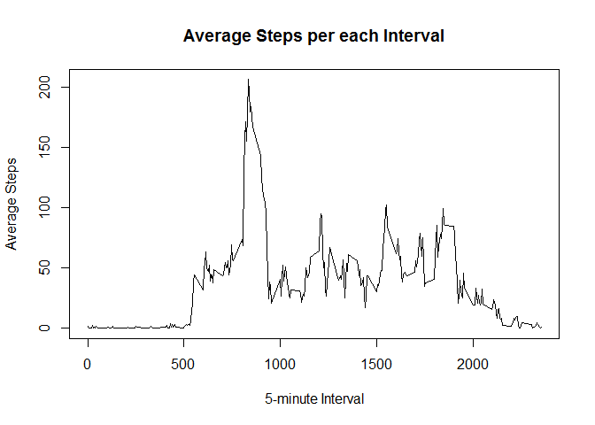
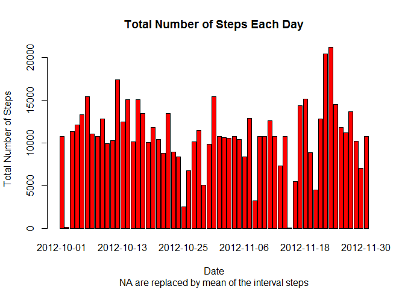
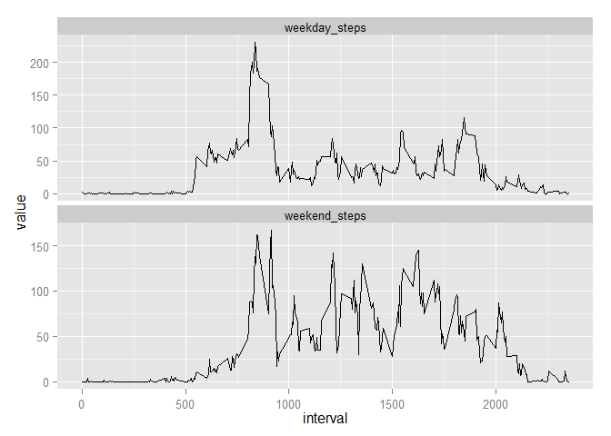

# Assignment1
Icefly  
Friday, July 18, 2014  

##Load the Data


```r
file <- "C:/Users/seom/Documents/Data & Analytics/Reproducible Research/Project 1/activity.csv"

a<-read.csv(file, header = TRUE, sep = ",")
```

##What is mean total number of steps taken per day?  
For this part of the assignment, you can ignore the missing values in the dataset.


Make a histogram of the total number of steps taken each day.  
Calculate and report the mean and median total number of steps taken per day.  


```r
## Calculate the total steps
sum_a <- aggregate(steps~date, data = a, FUN = "sum", na.action = na.omit)
## Make a histogram
barplot(sum_a$steps, names.arg = sum_a$date, col = "red", 
        main = "Total Number of Steps Each Day", 
        xlab = "Date", ylab = "Total Number of Steps" )
```

 

```r
## Calculate the mean and median
mean_a <- aggregate(steps~date, data = a, FUN = "mean", na.action = na.omit)
median_a <- aggregate(steps~date, data = a, FUN = "median", na.action = na.omit)
## combine into one data frame and name the columes properly
summary_a <- data.frame(mean_a, median_a$steps)
colnames(summary_a)<-c("date","mean_steps", "median_steps")
summary_a
```

```
##          date mean_steps median_steps
## 1  2012-10-02     0.4375            0
## 2  2012-10-03    39.4167            0
## 3  2012-10-04    42.0694            0
## 4  2012-10-05    46.1597            0
## 5  2012-10-06    53.5417            0
## 6  2012-10-07    38.2465            0
## 7  2012-10-09    44.4826            0
## 8  2012-10-10    34.3750            0
## 9  2012-10-11    35.7778            0
## 10 2012-10-12    60.3542            0
## 11 2012-10-13    43.1458            0
## 12 2012-10-14    52.4236            0
## 13 2012-10-15    35.2049            0
## 14 2012-10-16    52.3750            0
## 15 2012-10-17    46.7083            0
## 16 2012-10-18    34.9167            0
## 17 2012-10-19    41.0729            0
## 18 2012-10-20    36.0938            0
## 19 2012-10-21    30.6285            0
## 20 2012-10-22    46.7361            0
## 21 2012-10-23    30.9653            0
## 22 2012-10-24    29.0104            0
## 23 2012-10-25     8.6528            0
## 24 2012-10-26    23.5347            0
## 25 2012-10-27    35.1354            0
## 26 2012-10-28    39.7847            0
## 27 2012-10-29    17.4236            0
## 28 2012-10-30    34.0938            0
## 29 2012-10-31    53.5208            0
## 30 2012-11-02    36.8056            0
## 31 2012-11-03    36.7049            0
## 32 2012-11-05    36.2465            0
## 33 2012-11-06    28.9375            0
## 34 2012-11-07    44.7326            0
## 35 2012-11-08    11.1771            0
## 36 2012-11-11    43.7778            0
## 37 2012-11-12    37.3785            0
## 38 2012-11-13    25.4722            0
## 39 2012-11-15     0.1424            0
## 40 2012-11-16    18.8924            0
## 41 2012-11-17    49.7882            0
## 42 2012-11-18    52.4653            0
## 43 2012-11-19    30.6979            0
## 44 2012-11-20    15.5278            0
## 45 2012-11-21    44.3993            0
## 46 2012-11-22    70.9271            0
## 47 2012-11-23    73.5903            0
## 48 2012-11-24    50.2708            0
## 49 2012-11-25    41.0903            0
## 50 2012-11-26    38.7569            0
## 51 2012-11-27    47.3819            0
## 52 2012-11-28    35.3576            0
## 53 2012-11-29    24.4688            0
```

##What is the average daily activity pattern?  
Make a time series plot (i.e. type = "l") of the 5-minute interval (x-axis) and the average number of steps taken, averaged across all days (y-axis).  
Which 5-minute interval, on average across all the days in the dataset, contains the maximum number of steps?  


```r
average_interval<-aggregate(steps~interval, data = a, 
                            FUN = "mean", na.action = na.omit)
plot(average_interval$interval, average_interval$steps, type="l", 
     main = "Average Steps per each Interval", xlab = "5-minute Interval",
     ylab = "Average Steps")
```

 

```r
max_interval <- average_interval[average_interval$steps == 
                                   max(average_interval$steps),]$interval
max_interval
```

```
## [1] 835
```

##Imputing missing values  

Note that there are a number of days/intervals where there are missing values (coded as NA). The presence of missing days may introduce bias into some calculations or summaries of the data.  
Calculate and report the total number of missing values in the dataset (i.e. the total number of rows with NAs).    
Devise a strategy for filling in all of the missing values in the dataset. The strategy does not need to be sophisticated. For example, you could use the mean/median for that day, or the mean for that 5-minute interval, etc.  
Create a new dataset that is equal to the original dataset but with the missing data filled in.  
Make a histogram of the total number of steps taken each day and Calculate and report the mean and median total number of steps taken per day. Do these values differ from the estimates from the first part of the assignment? What is the impact of imputing missing data on the estimates of the total daily number of steps?  


```r
a_NAvalues <- nrow(a[is.na(a$steps),] )
a_NAvalues
```

```
## [1] 2304
```

```r
addaverage <- function(x,y=average_interval){
  ##61 days
  for (i in 1:17568){
    rint <- x[i,"interval"]
    rint <- as.integer(rint)
    if (is.na(x[i,"steps"])) {
      x[i,"steps"]<-round(y[y$interval == rint, "steps"], digits = 0)
    }
  }
  x
}

new_no_na_a <- addaverage(a)

summary(new_no_na_a)
```

```
##      steps               date          interval   
##  Min.   :  0.0   2012-10-01:  288   Min.   :   0  
##  1st Qu.:  0.0   2012-10-02:  288   1st Qu.: 589  
##  Median :  0.0   2012-10-03:  288   Median :1178  
##  Mean   : 37.4   2012-10-04:  288   Mean   :1178  
##  3rd Qu.: 27.0   2012-10-05:  288   3rd Qu.:1766  
##  Max.   :806.0   2012-10-06:  288   Max.   :2355  
##                  (Other)   :15840
```

```r
sum_new_a <- aggregate(steps~date, data = new_no_na_a, FUN = "sum")

barplot(sum_new_a$steps, names.arg = sum_new_a$date, col = "red", 
        main = "Total Number of Steps Each Day", 
        sub = "NA are replaced by mean of the interval steps",
        xlab = "Date", ylab = "Total Number of Steps" )
```

 

```r
mean_new_a <- aggregate(steps~date, data = new_no_na_a, FUN = "mean") 
median_new_a <- aggregate(steps~date, data = new_no_na_a, FUN = "median")
summary_new_a <- data.frame(mean_new_a, median_new_a$steps)
colnames(summary_new_a)<-c("date","mean_steps", "median_steps")
##Compare the two tables
summary(summary_new_a)
```

```
##          date      mean_steps     median_steps  
##  2012-10-01: 1   Min.   : 0.14   Min.   : 0.00  
##  2012-10-02: 1   1st Qu.:34.09   1st Qu.: 0.00  
##  2012-10-03: 1   Median :37.37   Median : 0.00  
##  2012-10-04: 1   Mean   :37.38   Mean   : 4.52  
##  2012-10-05: 1   3rd Qu.:44.48   3rd Qu.: 0.00  
##  2012-10-06: 1   Max.   :73.59   Max.   :34.50  
##  (Other)   :55
```

```r
summary(summary_a)
```

```
##          date      mean_steps     median_steps
##  2012-10-02: 1   Min.   : 0.14   Min.   :0    
##  2012-10-03: 1   1st Qu.:30.70   1st Qu.:0    
##  2012-10-04: 1   Median :37.38   Median :0    
##  2012-10-05: 1   Mean   :37.38   Mean   :0    
##  2012-10-06: 1   3rd Qu.:46.16   3rd Qu.:0    
##  2012-10-07: 1   Max.   :73.59   Max.   :0    
##  (Other)   :47
```

##Are there differences in activity patterns between weekdays and weekends?  

For this part the weekdays() function may be of some help here. Use the dataset with the filled-in missing values for this part.  
Create a new factor variable in the dataset with two levels -- "weekday" and "weekend" indicating whether a given date is a weekday or weekend day.  
Make a panel plot containing a time series plot (i.e. type = "l") of the 5-minute interval (x-axis) and the average number of steps taken, averaged across all weekday days or weekend days (y-axis).  


```r
addweekday <- function (x){
  for (i in 1:17568){
    if (weekdays(as.Date(x[i,"date"]))=="Sunday") {
      x[i,"weekend"] <- "weekend"
    }
    else if  (weekdays(as.Date(x[i, "date"]))=="Saturday") {
      x[i,"weekend"] <- "weekend"
    }          
    else {
      x[i, "weekend"] <- "weekday"
    }
  }
  x
}

a_weekday <- addweekday(new_no_na_a)


g<-aggregate(steps~interval+weekend, data = a_weekday,mean)

ts1 <- g[g[,2] == "weekday",]
colnames(ts1) <- c("interval", "weekday", "weekday_steps")

ts2 <- g[g[,2] == "weekend",]
colnames(ts2) <- c("interval", "weekend", "weekend_steps")
ts_set <-merge(ts1, ts2, by = "interval")

library(ggplot2)
```

```
## Warning: package 'ggplot2' was built under R version 3.1.1
```

```r
library(reshape2)

ts_melt<-melt(subset(ts_set, 
                     select = c("interval", "weekday_steps", "weekend_steps")),
                               ,id.vars = "interval")
ggplot(ts_melt, aes(x = interval, y = value)) + 
  geom_line() + 
  facet_wrap(~ variable, scales = 'free_y', ncol = 1)
```

 

